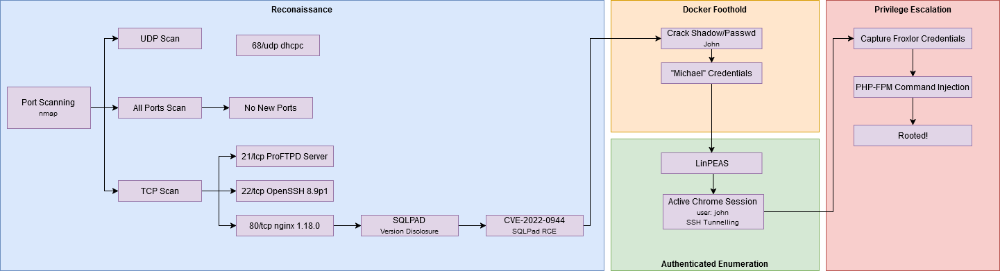

# Summary

The Sightless machine is classified as Easy. Albiet some aspects are somewhat straightforward whilst others are more convelouted initially. The machine tests some basic port scanning, version disclosure vulnerabilities and Google 'Dorking' for CVEs. Sightless incorporates areas of Docker containers, Linux privilege escalation including unshadowing, or 'cracking' of passwords, lateral movement or pivoting. It then challenges your tunnelling knowledge to gain access to unroutable services on the system leading you to perform simple command injection where you finally gain root access and pwn the system. Overall, a good machine testing your basic networking knowledge, Linux privilege escalation, reconnaissance and enumeration, password cracking, and demonstrating a solid foundation of penetration testing.

# Reconnaissance

The initial phase of most penetration tests is the Reconnaissance or Information Gathering phase whereby we attempt to gather as much information as possible via active and passive means. 

Personal preference, a nice tip is setting the target IP address as an environment variable in the terminal via: `export IP=<IP-address>`. Anytime you need to interact with the system, you can just call it using `$IP` as seen in the below nmap scan.

**Nmap: Initial TCP Scan**
```
# Nmap 7.94SVN scan initiated Thu Jan  2 20:36:14 2025 as: nmap -sC -A --vv -oN recon/nmap.initial 10.10.11.32
Nmap scan report for 10.10.11.32
Host is up, received echo-reply ttl 63 (0.024s latency).
Scanned at 2025-01-02 20:36:14 GMT for 81s
Not shown: 997 closed tcp ports (reset)
PORT   STATE SERVICE REASON         VERSION
21/tcp open  ftp     syn-ack ttl 63
| fingerprint-strings: 
|   GenericLines: 
|     220 ProFTPD Server (sightless.htb FTP Server) [::ffff:10.10.11.32]
|     Invalid command: try being more creative
|_    Invalid command: try being more creative
22/tcp open  ssh     syn-ack ttl 63 OpenSSH 8.9p1 Ubuntu 3ubuntu0.10 (Ubuntu Linux; protocol 2.0)
| ssh-hostkey: 
|   256 c9:6e:3b:8f:c6:03:29:05:e5:a0:ca:00:90:c9:5c:52 (ECDSA)
| ecdsa-sha2-nistp256 AAAAE2VjZHNhLXNoYTItbmlzdHAyNTYAAAAIbmlzdHAyNTYAAABBBGoivagBalUNqQKPAE2WFpkFMj+vKwO9D3RiUUxsnkBNKXp5ql1R+kvjG89Iknc24EDKuRWDzEivKXYrZJE9fxg=
|   256 9b:de:3a:27:77:3b:1b:e1:19:5f:16:11:be:70:e0:56 (ED25519)
|_ssh-ed25519 AAAAC3NzaC1lZDI1NTE5AAAAIA4BBc5R8qY5gFPDOqODeLBteW5rxF+qR5j36q9mO+bu
80/tcp open  http    syn-ack ttl 63 nginx 1.18.0 (Ubuntu)
| http-methods: 
|_  Supported Methods: GET HEAD POST OPTIONS
|_http-title: Did not follow redirect to http://sightless.htb/
|_http-server-header: nginx/1.18.0 (Ubuntu)
1 service unrecognized despite returning data. If you know the service/version, please submit the following fingerprint at https://nmap.org/cgi-bin/submit.cgi?new-service :
SF-Port21-TCP:V=7.94SVN%I=7%D=1/2%Time=6776F8CA%P=x86_64-pc-linux-gnu%r(Ge
SF:nericLines,A0,"220\x20ProFTPD\x20Server\x20\(sightless\.htb\x20FTP\x20S
SF:erver\)\x20\[::ffff:10\.10\.11\.32\]\r\n500\x20Invalid\x20command:\x20t
SF:ry\x20being\x20more\x20creative\r\n500\x20Invalid\x20command:\x20try\x2
SF:0being\x20more\x20creative\r\n");
No exact OS matches for host (If you know what OS is running on it, see https://nmap.org/submit/ ).
TCP/IP fingerprint:
OS:SCAN(V=7.94SVN%E=4%D=1/2%OT=21%CT=1%CU=43426%PV=Y%DS=2%DC=T%G=Y%TM=6776F
OS:90F%P=x86_64-pc-linux-gnu)SEQ(SP=FD%GCD=1%ISR=10A%TI=Z%CI=Z%TS=1)SEQ(SP=
OS:FD%GCD=1%ISR=10A%TI=Z%CI=Z%II=I%TS=A)OPS(O1=M53CST11NW7%O2=M53CST11NW7%O
OS:3=M53CNNT11NW7%O4=M53CST11NW7%O5=M53CST11NW7%O6=M53CST11)WIN(W1=FE88%W2=
OS:FE88%W3=FE88%W4=FE88%W5=FE88%W6=FE88)ECN(R=Y%DF=Y%T=40%W=FAF0%O=M53CNNSN
OS:W7%CC=Y%Q=)T1(R=Y%DF=Y%T=40%S=O%A=S+%F=AS%RD=0%Q=)T2(R=N)T3(R=N)T4(R=Y%D
OS:F=Y%T=40%W=0%S=A%A=Z%F=R%O=%RD=0%Q=)T5(R=Y%DF=Y%T=40%W=0%S=Z%A=S+%F=AR%O
OS:=%RD=0%Q=)T6(R=Y%DF=Y%T=40%W=0%S=A%A=Z%F=R%O=%RD=0%Q=)T7(R=N)U1(R=N)U1(R
OS:=Y%DF=N%T=40%IPL=164%UN=0%RIPL=G%RID=G%RIPCK=G%RUCK=G%RUD=G)IE(R=N)IE(R=
OS:Y%DFI=N%T=40%CD=S)

Uptime guess: 9.295 days (since Tue Dec 24 13:32:52 2024)
Network Distance: 2 hops
TCP Sequence Prediction: Difficulty=253 (Good luck!)
IP ID Sequence Generation: All zeros
Service Info: OS: Linux; CPE: cpe:/o:linux:linux_kernel

TRACEROUTE (using port 8888/tcp)
HOP RTT      ADDRESS
1   22.17 ms 10.10.14.1
2   22.23 ms 10.10.11.32

Read data files from: /usr/bin/../share/nmap
OS and Service detection performed. Please report any incorrect results at https://nmap.org/submit/ .
# Nmap done at Thu Jan  2 20:37:35 2025 -- 1 IP address (1 host up) scanned in 81.08 seconds
```

In addition to the initial nmap scan, a UDP scan was run alongside an `-p-` all port scan to detect an uncommon ports. It's very common for systems to be using ports around 8000 (8080 being a common one), however sometimes a standard nmap scan may not capture this. We don't want to run intrusive scans for all 65535 ports, instead we port scan and **then** enumerate them.

We can see three available TCP services: FTP, SSH and HTTP.

## Probing FTP

Starting off with the low-hanging fruit, whilst waiting for the all ports results to return, we quickly try the ftp anonymous user. Unfortunately, no luck there.


## Probing HTTP

Leaving SSH for later as brute-force password attacks are almost always a last resort due to their intensity, noise and time. We can always revisit it if we have a username. 

The HTTP service was running an IT admin page offering services for SQLPad, Froxlor and Database & Server Management. 


In the background, `feroxbuster` was used for directory enumeration to discover any subdomains, directories or files - various wordlists were used in combination with `gobuster`, nothing of particular interest was found.

In order of what's displayed, SQLPad was first investigated. After taking a look around to see if we could potentially exploit some SQLi attacks, we decide to take a look at the service information at the top right. This presented us with a Version Disclosure 'vulnerability'. 


After some quick Google Dorking for SQLPad 6.10 vulnerabilities, we find a Github page with a CVE affecting this version. 


We download this bash script, make it executable (`chmod +x ./exploit.sh`), pipe in our target IP/FQDN, and listener. We have a remote shell!


*My windows may aswell be in different post codes, you may have to squint/zoom.*


# Docker Foothold

We quickly realise a lot of commands and tools are unavailable from our foothold. Commands like `nano`, and `vi` are not installed - strange having no common text editor. We can use Linpeas to enumerate the machine and discover any potential poinst of privilege escalation. Taking a mooch around the system, it's obvious we are inside a docker container and need to gain access to the host system.

The `/etc/shadow` file seems interesting. It contains two hashes for users `Michael` and `root`. 

## Unshadowing with John

[erev0s](https://erev0s.com/blog/cracking-etcshadow-john/) provides a useful guide for unshadowing files using the passwd and shadow files on a system with John The Ripper.


Unfortunately, sometimes you need to know when to give up. After waiting an uncomfortable amount of time, switching the wordlist to `rockyou.txt` seemed to have struck some luck. 


> [GhostLox]: *I will forever be grateful to the contributor who made the credentials highlighted in colour (whether that's Zsh and/or John).*

# Digging with SSH

The Michael credentials unshadowed login to the SSH service. The user flag can be found in Michael's home directory.


`linpeas.sh` is conveniently on the system which is typically used for privilege escalation vectors and some general automated enumeration of the system.

Linpeas highlights a potential PE vector of 95% likelihood as seen in the following section.

# Google Chrome Session

```
root        1180  0.0  0.0  10344  3852 ?        S    12:55   0:00  _ /usr/sbin/CRON -f -P
john        1205  0.0  0.0   2892  1036 ?        Ss   12:55   0:00      _ /bin/sh -c sleep 110 && /usr/bin/python3 /home/john/automation/administration.py
john        1597  0.0  0.6  33660 24424 ?        S    12:57   0:21          _ /usr/bin/python3 /home/john/automation/administration.py
john        1598  0.3  0.3 33630172 15380 ?      Sl   12:57   2:21              _ /home/john/automation/chromedriver --port=54995
john        1609  0.6  2.8 34011320 113172 ?     Sl   12:57   3:53              |   _ /opt/google/chrome/chrome --allow-pre-commit-input --disable-background-networking --disable-client-side-phishing-detection --disable-default-apps --disable-dev-shm-usage --disable-hang-monitor --disable-popup-blocking --disable-prompt-on-repost --disable-sync --enable-automation --enable-logging --headless --log-level=0 --no-first-run --no-sandbox --no-service-autorun --password-store=basic --remote-debugging-port=0 --test-type=webdriver --use-mock-keychain --user-data-dir=/tmp/.org.chromium.Chromium.mN2NY4 data:,
john        1615  0.0  1.4 34112448 56440 ?      S    12:57   0:00              |       _ /opt/google/chrome/chrome --type=zygote --no-zygote-sandbox --no-sandbox --enable-logging --headless --log-level=0 --headless --crashpad-handler-pid=1611 --enable-crash-reporter
john        1630  0.4  3.0 34362344 120816 ?     Sl   12:57   2:27              |       |   _ /opt/google/chrome/chrome --type=gpu-process --no-sandbox --disable-dev-shm-usage --headless --ozone-platform=headless --use-angle=swiftshader-webgl --headless --crashpad-handler-pid=1611 --gpu-preferences=WAAAAAAAAAAgAAAMAAAAAAAAAAAAAAAAAABgAAEAAAA4AAAAAAAAAAAAAAAAAAAAAAAAAAAAAAAAAAAAAAAAAAAAAAAAAAAAGAAAAAAAAAAYAAAAAAAAAAgAAAAAAAAACAAAAAAAAAAIAAAAAAAAAA== --use-gl=angle --shared-files --fie
john        1616  0.0  1.4 34112452 56872 ?      S    12:57   0:00              |       _ /opt/google/chrome/chrome --type=zygote --no-sandbox --enable-logging --headless --log-level=0 --headless --crashpad-handler-pid=1611 --enable-crash-reporter
john        1661  2.9  7.0 1186807664 280272 ?   Sl   12:57  18:15              |       |   _ /opt/google/chrome/chrome --type=renderer --headless --crashpad-handler-pid=1611 --no-sandbox --disable-dev-shm-usage --enable-automation --remote-debugging-port=0 --test-type=webdriver --allow-pre-commit-input --ozone-platform=headless --disable-gpu-compositing --lang=en-US --num-raster-threads=1 --renderer-client-id=5 --time-ticks-at-unix-epoch=-1735822536031771 --launc
john        1633  0.1  2.1 33900068 86592 ?      Sl   12:57   0:51              |       _ /opt/google/chrome/chrome --type=utility --utility-sub-type=network.mojom.NetworkService --lang=en-US --service-sandbox-type=none --no-sandbox --disable-dev-shm-usage --use-angle=swiftshader-webgl --use-gl=angle --headless --crashpad-handler-pid=1611 --shared-files=v8_context_snapshot_data:100 --field-trial-handle=3,i,15800433676110378804,14309124821839705941,262144 --disable-features=PaintHolding --variations-seed-version --enable-logging --log-level=0 --enable-crash-reporter
```

**What's happening here?**

- **Cronjob Execution:**
A cron daemon is running under the user `root` with `-f` indicating it's running in the foreground. 
A child process under CRON is being run by the user `john`
<br>
- **Script Activity:**
The CRON child process is executing a script every 110 seconds (`sleep 110`) located at `/home/john/automation/administration.py`
<br>
- **Remote Debugging:**
Chrome is being controlled remotely, which could be by the Python administration script indicated by `--remote-debugging-port=0`
When a service is assigned to port 0, it essentially chooses a random unused port.

Taking port 0 into consideration, we can refer back to a section of the Linpeas output titled "Active Ports". 


A few high numbered ports are listed - interesting. We can also use something like `netstat -tulpn` or `ss -tulpn` to get the same results. As these are hosted on the localhost system via the loopback address, unless you are routing traffic through this system, you will be unable to access those services (not routable beyond the host)

## SSH Tunnelling

> **Recap:** To reiterate as this section can be a little convoluted. We found an interesting Google Chrome session under the user john executing in debugging mode - commonly used for development which may contain sensitive information. We discover it's binding to port 0, in other words, a random port. As these are not routable beyond the host, we need to create a tunnel to the host allowing access to those services from our attacker machine. 

In order to access these services we need to tunnel traffic through a route to the target and back. We do not know which of these random ports are the one to use, so we can tunnel all of them using the following command from our attacker machine:

`ssh -L 42933:127.0.0.1:42933 -L 54995:127.0.0.1:54995 -L 44215:127.0.0.1:44215 -L 33060:127.0.0.1:33060 -L 8080:127.0.0.1:8080 michael@10.10.11.32`

# Capturing Froxlor Credentials

**Ensure `localhost admin.sightless.htb` is added to `/etc/hosts` file before progressing.**

From here we can navigate to `chrome://inspect`, click 'Configure' and add the ports revealed by Linpeas Active Ports/netstat/ss.

Wait a moment as the cron script runs every 110 seconds. We should see something appear under "Remote Target" like: `Froxlor http://admin.sightless/htb:8080/index.php`. If we click on `index.php` quickly enough, the credentials to the Froxlor service are revealed in plaintext; as demonstrated below:


# Gaining Root Access

Taking a look around the interface, there appears to be a nice and convenient command injection option under "PHP > PHP-FPM versions". Modifying the `php-fpm restart command` to copy the root `id_rsa` key to an accessible directory like `/tmp`, gaining a reverse shell, or directly catting the root.txt flag should pwn this system.


🎉 System Pwned!